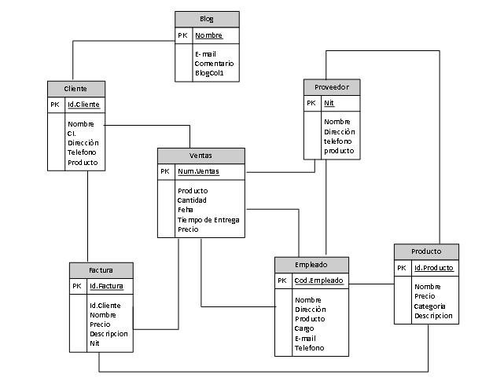

# Sistema Mobiliario v.1.0
## Introduccion 
En el presente documento  se desarrollo la parte del Back-End de un sostema mobiliario  dando mas enfasis a la seccion de Blog y Productos ,tambien se utilizo el MQL Management studio 2018 para desarollar la base de datos ademas de postman para ejecutar las peticiones :GET,POST,PUT y DELETE.

## Tecnologias Utilizadas

- PHP
- JSON
- SQL SERVER
- REST
- DEBIAN
## Modelado de la Base de datos

Para la modelacion de la base de datos  se incio realizadon un modelo entidad relacion, o como  se le denomina el modelo pata de gallo  con lo cual despues se lo paso  al programa SQL Management Studio, en el cual se plasmo  del modelo.

**Figura 1**|- Modelo relacional base de datos



## API
**Configuracion**\
la base  de datos se creo con el usuario (localdb)\UZAKI , con el siguiente formato  CREATE DATA BASE y despues se creo cada tabla con los restivos datos,  CREATE TABLE [dbo].[Producto] , lo campos corresspondiente con varchar,  lo valores  algunso se  le spermitio el valor NULL 

**Seeders**\
Para inicar la base de datos se debe de hacer corre  la siguiente archivo /Seeders/db.php.

## Servicios ##
- cliente
- Ventas
- Proveedor
- Factura
- Producto
- Empleado 
- Blog

### Blog
| GET            | [/?endpoint=blog](http://localhost/API/?endpoint=blog) |
| -------------- |------------------------------------------------------------ |
| **Parámetros** |Ninguno                                                      |
##### Cuerpo

Ninguno

##### Respuestas
```json
status: 200
{
    
        "Num":"1",
        "Name":"EL pepe",
        "E-mail": "pepe_json422@gmail.com",
         "Comentario": "Somos una empresa con alta vocación de servicio; brindamos un asesoramiento experto a medida "
}
```

```json
status: 400
{
    "Mensaje": "Error  con el endpoint  Blog"
}
```
| POST            | [/?endpoint=blog](http://localhost/API/?endpoint=blog) |
| -------------- |------------------------------------------------------------ |
| **Parámetros** |Ninguno                                                      |
##### Cuerpo

```json
{
  "Name":"EL pepe",
  "E-mail": "pepe_json422@gmail.com",
  
}
```

##### Respuestas
```json
status:200
{
    "Num": "1"
}
```
```json
status:400
{
    "Mensaje": "Error de Ingreso"
}
```
| PUT           | [/?endpoint=ActualizaComentario](http://localhost/API/?endpoint=ActualizarComentario) |
| -------------- |------------------------------------------------------------ |
| **Parámetros** |Ninguno                                                      |
##### Cuerpo

```json
{
  "Name":"EL pepe",
  "E-mail": "pepe_json422@gmail.com",
  
}
```
```json
status:200
{
    "Mensaje": "Comentario  Actualizado"
}
```
```json
status:400
{
    "Mensaje": "Error al actualizar el comentario"
}
```
| DELETE         | [/?endpoint=EliminarComentario](http://localhost/API/?endpoint=EliminarComentario) |
| -------------- | --------------------------------------------------------------------------- |
| **Parámetros** | **:Num** Numero del Comentario
##### Cuerpo

Ninguno

##### Respuestas
```json
status:200
{
    "Mensaje": "Comentario eliminado"
}
```
```json
status:400
{
    "Mensaje": "Error al eliminar el comentario"
}
```

### Repositorio
En este backend se trabajo desde el 25 de diciembre,  viendo los videos de las clases para guiarme mejor  todo estara en la  carpeta BackendPardo, en  la subcarpeta Apidoc


https://github.com/Brb-code/hohovery/tree/PARDO/Apidoc
