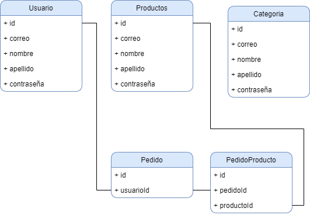

# API Doc v.1 - Ho Ho Very

## Introducción

Lorem Ipsum is simply dummy text of the printing and typesetting industry. Lorem Ipsum has been the industry's standard dummy text ever since the 1500s, when an unknown printer took a galley of type and scrambled it to make a type specimen book. It has survived not only five centuries, but also the leap into electronic typesetting, remaining essentially unchanged. It was popularised in the 1960s with the release of Letraset sheets containing Lorem Ipsum passages, and more recently with desktop publishing software like Aldus PageMaker including versions of Lorem Ipsum.

## Tecnologías utilizadas

- PHP
- JSON
- REST

## Modelado de la base de datos

Lorem Ipsum is simply dummy text of the printing and typesetting industry. Lorem Ipsum has been the industry's standard dummy text ever since the 1500s, when an unknown printer took a galley of type and scrambled it to make a type specimen book. It has survived not only five centuries, but also the leap into electronic typesetting, remaining essentially unchanged. It was popularised in the 1960s with the release of Letraset sheets containing Lorem Ipsum passages, and more recently with desktop publishing software like Aldus PageMaker including versions of Lorem Ipsum.



**Figura 1** - Modelo relacional base de datos

## API

### Servicios

- Usuarios
- Pedidos
- Repartidores

### Usuarios

| GET            | [/?endpoint=usuario](https://localhost/api/?endpoint=usuario) |
| -------------- | ------------------------------------------------------------- |
| **Parámetros** | Ninguno                                                       |

##### Cuerpo

Ninguno

##### Respuestas

```json
status: 200
[
    {
        id:1,
        nombre: "Pepito",
        ...
    }, ...
]
```

```json
status: 400
{
    mensaje: "No se pudo obtener los datos"
}
```

| GET            | [/?endpoint=usuario&id=:id](https://localhost/api/?endpoint=usuario&id=:id) |
| -------------- | --------------------------------------------------------------------------- |
| **Parámetros** | **:id** Identificador del usuario.                                          |

##### Cuerpo

Ninguno

##### Respuestas

```json
status: 200
    {
        id:1,
        nombre: "Pepito",
        ...
    }
```

```json
status: 400
{
    mensaje: "No se pudo obtener al usuario"
}
```

| POST           | [/?endpoint=usuario](https://localhost/api/?endpoint=usuario) |
| -------------- | ------------------------------------------------------------- |
| **Parámetros** | Ninguno                                                       |

##### Cuerpo

```json
{
  "nombre": "Pepito", //Requerido
  "apellido": "Perez", //Opcional
  "usuario": "usuario", //Requerido
  "contraseña": "123321" //Requerido
}
```

##### Respuestas

```json
status: 200
    {
        id:1
    }
```

```json
status: 400
{
    mensaje: "No se pudo registrar al usuario"
}
```

```json
status: 401
{
    mensaje: "Faltan datos requeridos"
}
```

| PUT            | [/?endpoint=usuario&id=:id](https://localhost/api/?endpoint=usuario&id=:id) |
| -------------- | --------------------------------------------------------------------------- |
| **Parámetros** | **:id** Identificador del usuario                                           |

##### Cuerpo

```json
{
  "nombre": "Pepito", //Requerido
  "apellido": "Perez", //Opcional
  "usuario": "usuario", //Requerido
  "contraseña": "123321" //Requerido
}
```

##### Respuestas

```json
status: 200
{
    mensaje:"Usuario actualizado"
}
```

```json
status: 400
{
    mensaje: "No se pudo actualizar al usuario"
}
```

| DELETE         | [/?endpoint=usuario&id=:id](https://localhost/api/?endpoint=usuario&id=:id) |
| -------------- | --------------------------------------------------------------------------- |
| **Parámetros** | **:id** Identificador del usuario                                           |

##### Cuerpo

Ninguno

##### Respuestas

```json
status: 200
{
    mensaje:"Usuario eliminado"
}
```

```json
status: 400
{
    mensaje: "No se pudo eliminar al usuario"
}
```

| POST           | [/?endpoint=login](https://localhost/api/?endpoint=login) |
| -------------- | --------------------------------------------------------- |
| **Parámetros** | Ninguno                                                   |

##### Cuerpo

```json
{
  "usuario": "usuario", //Requerido
  "contraseña": "123321" //Requerido
}
```

##### Respuestas

```json
status: 200
{
    token:"4asd2asd42sad8geguyi8SADsaoiupdklksad95sad"
}
```

```json
status: 400
{
    mensaje: "Usuario y/o contraseña incorrectas"
}
```

```json
status: 401
{
    mensaje: "Faltan datos requeridos"
}
```

### Repositorio

Lorem Ipsum is simply dummy text of the printing and typesetting industry. Lorem Ipsum has been the industry's standard dummy text ever since the 1500s, when an unknown printer took a galley of type and scrambled it to make a type specimen book. It has survived not only five centuries, but also the leap into electronic typesetting, remaining essentially unchanged. It was popularised in the 1960s with the release of Letraset sheets containing Lorem Ipsum passages, and more recently with desktop publishing software like Aldus PageMaker including versions of Lorem Ipsum.

<https://github.com/Brb-code/hohovery/tree/backend>
